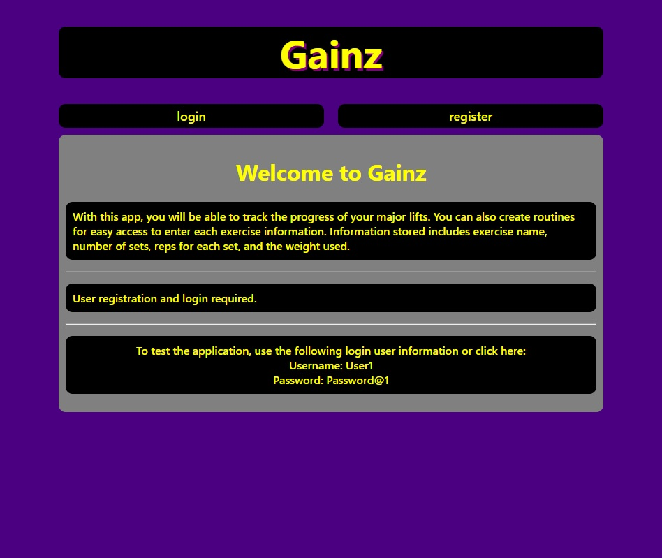
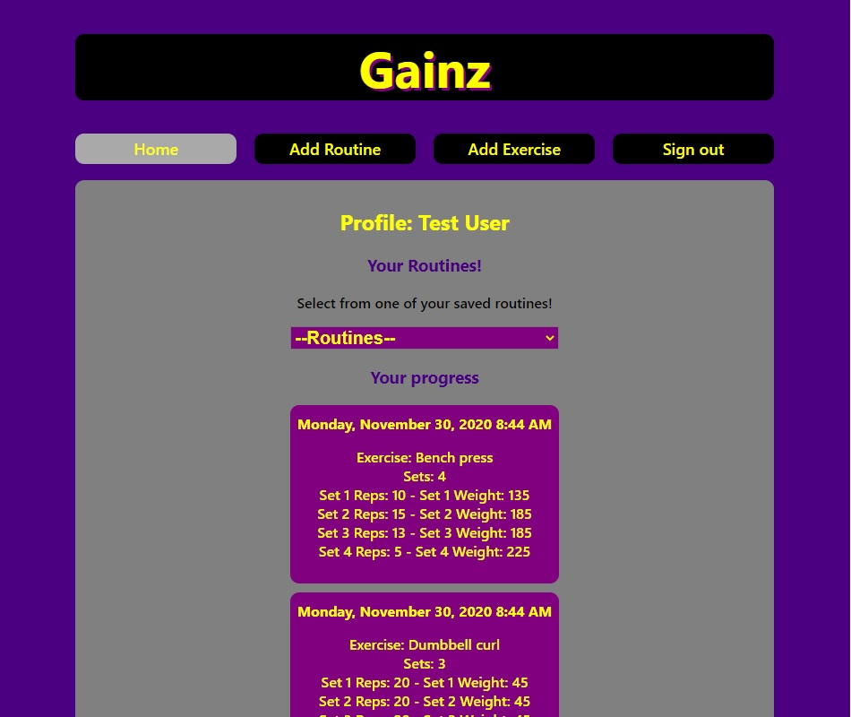
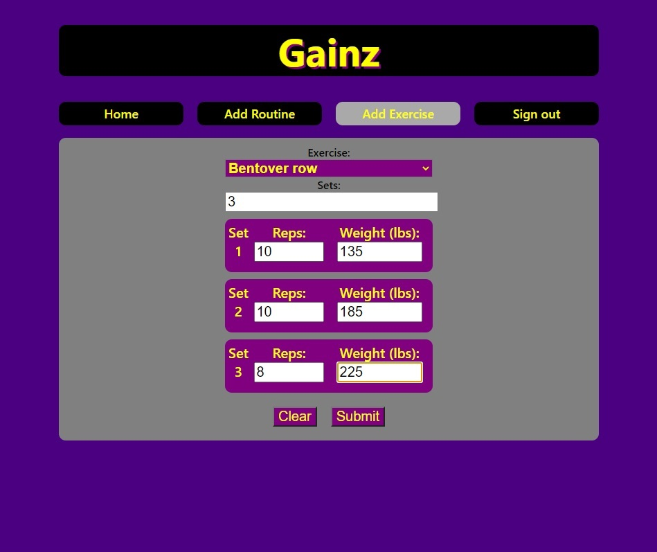
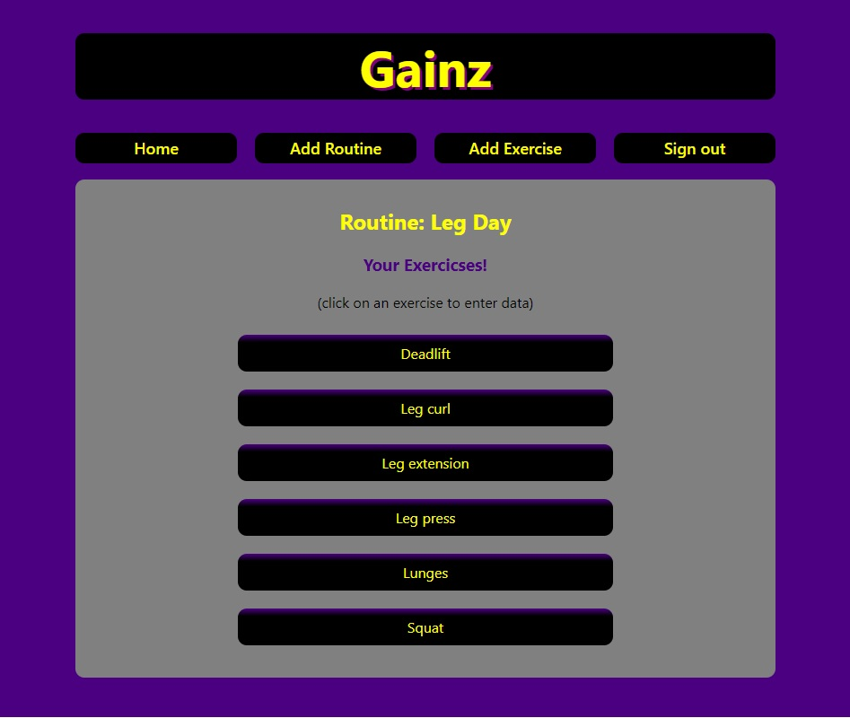
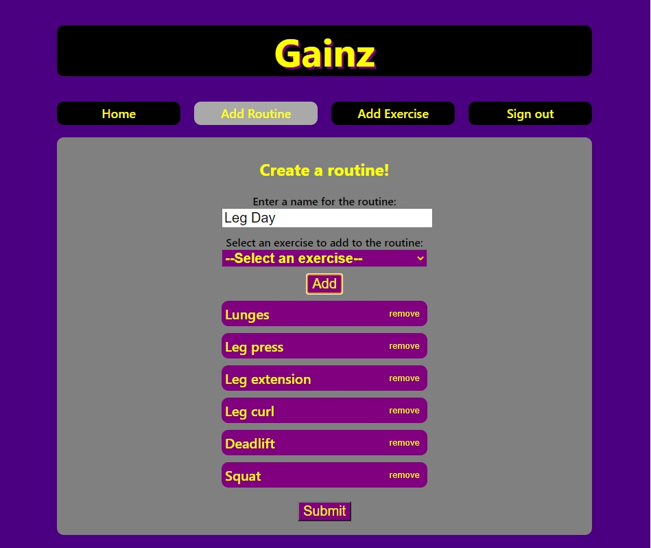

# Gainz API Client!

[LIVE GAINZ APP](https://gainz.vercel.app).

---
## Description:

This application stores exercises, routines, and exercise data (such as number of sets, reps, and the weights used). The Gainz application is used to track weightlifting progress. User registration and login required. Once logged in, token is provided which contains user information in order for specific data to be returned to the app.

---
## Landing Page
*Page includes description of application and demo user. Contains a navigation bar to take user to registration or login page.*

---
## Home Page
*Page includes drop down menu to select from save routines for quick entry of excercises to be done for the day. Also displays user exercise data with date the exercise was entered.*

---
## Exercise Page / Add exercise data
*Page allows user to enter exercise data. User will select exercise name, enter number of sets, and then entered the repetitions completed and weights used for each set.*

---
## Routine Page / Select exercise from routine
*User can select an exercise from their routine to enter the exercise information.*

---
## Add Routine Page
*User can create a routine by selecting from a list of exercises. If the user decides not to do a certain exercise, they can select the remove button next to it. Name for the routine is required.*

